

  <picture>
    <source media="(max-width: 640px)" srcset="./assets/customer-success-hero-mobile-v4.svg" />
    
  </picture>

 

<a href="https://github.com/zpthanos/production-stories">
  <picture>
    <source media="(max-width: 640px)" srcset="./assets/production-stories-cta-mobile-final-v2.svg" />
    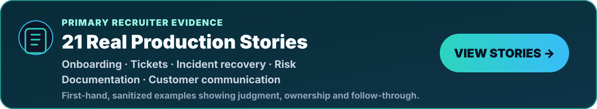
  </picture>
</a>

 

  
  
  

<h3 align="center">
  I help customers adopt, operate and gain value from technical products through onboarding, ticket resolution, documentation, risk identification and cross-functional coordination.
</h3>

 

<picture>
  <source media="(max-width: 640px)" srcset="./assets/positioning-panel-mobile-v3.svg" />
  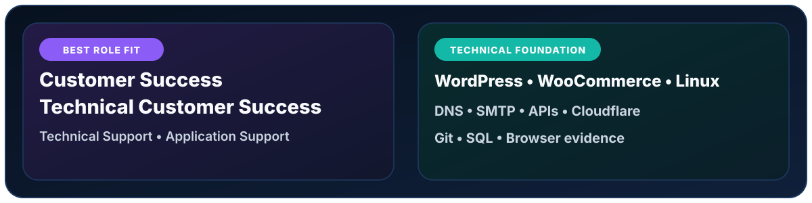
</picture>

 

<picture>
  <source media="(max-width: 640px)" srcset="./assets/customer-success-loop-mobile-v1.svg" />
  
</picture>

 

<picture>
  <source media="(max-width: 640px)" srcset="./assets/customer-request-playbook-mobile-v2.svg" />
  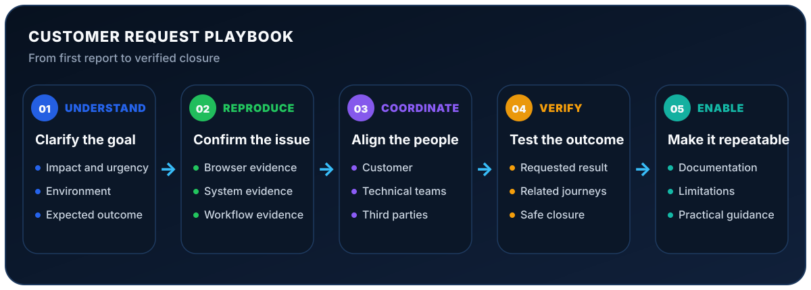
</picture>

 

<picture>
  <source media="(max-width: 640px)" srcset="./assets/implementation-evidence-mobile-v2.svg" />
  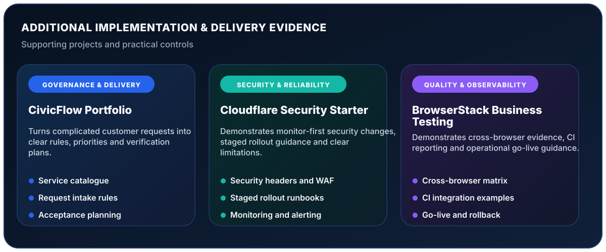
</picture>

  
  
  

 

<picture>
  <source media="(max-width: 640px)" srcset="./assets/customer-success-outcomes-mobile-v3.svg" />
  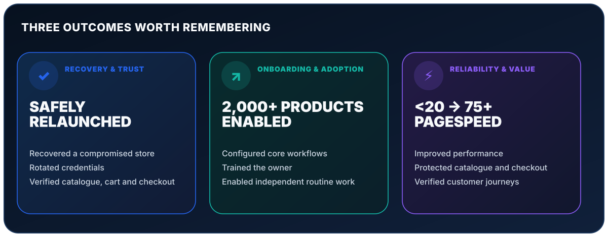
</picture>

  
  
  

 

<picture>
  <source media="(max-width: 640px)" srcset="./assets/customer-success-fit-mobile-v3.svg" />
  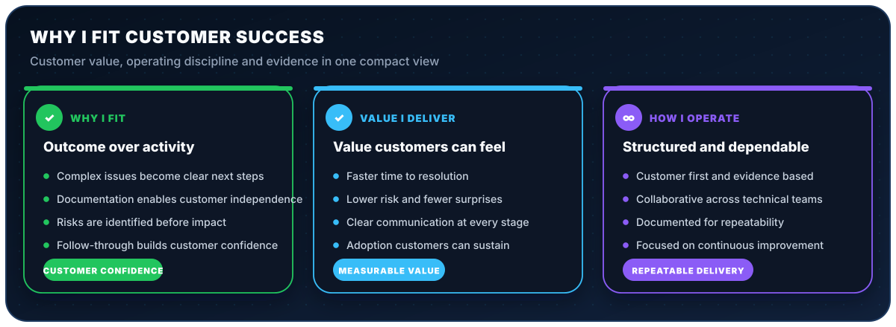
</picture>

 

<picture>
  <source media="(max-width: 640px)" srcset="./assets/recruiter-evidence-mobile-v3.svg" />
  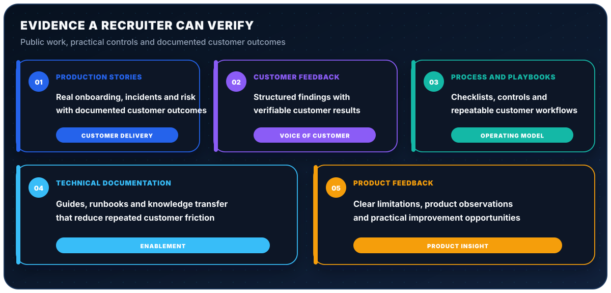
</picture>

  
  
  
   
  
  

 

<picture>
  <source media="(max-width: 640px)" srcset="./assets/open-source-readiness-mobile-v3.svg" />
  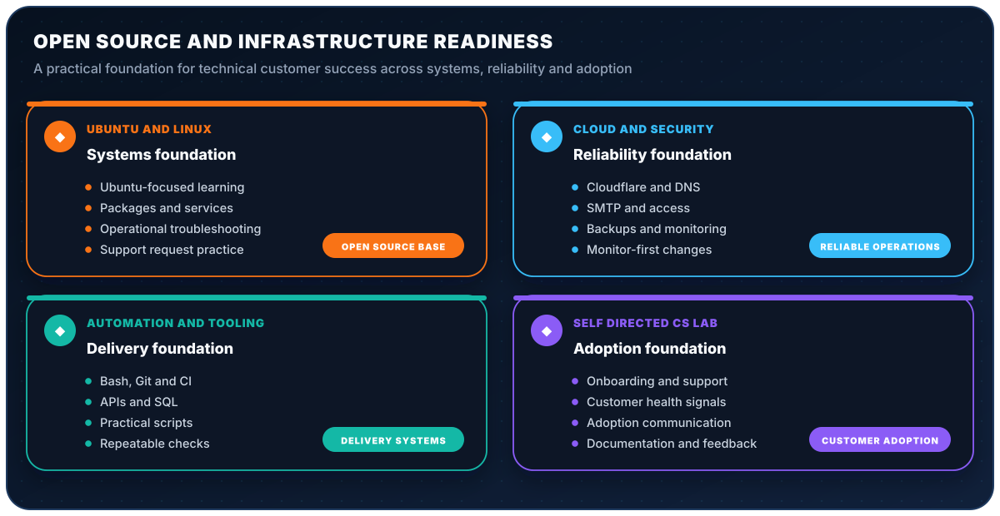
</picture>

  

 

<picture>
  <source media="(max-width: 640px)" srcset="./assets/technical-toolkit-mobile-v1.svg" />
  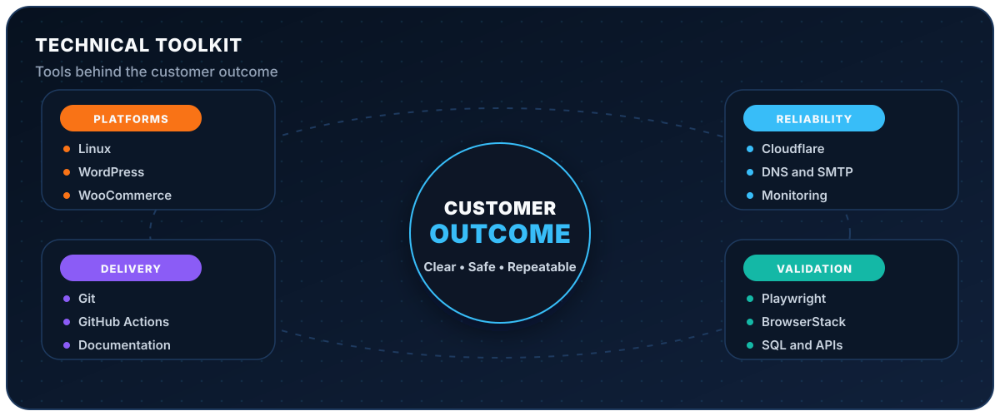
</picture>

 

<strong>🔎 Expand the supporting evidence index</strong>

 

<picture>
  <source media="(max-width: 640px)" srcset="./assets/supporting-evidence-index-mobile-v2.svg" />
  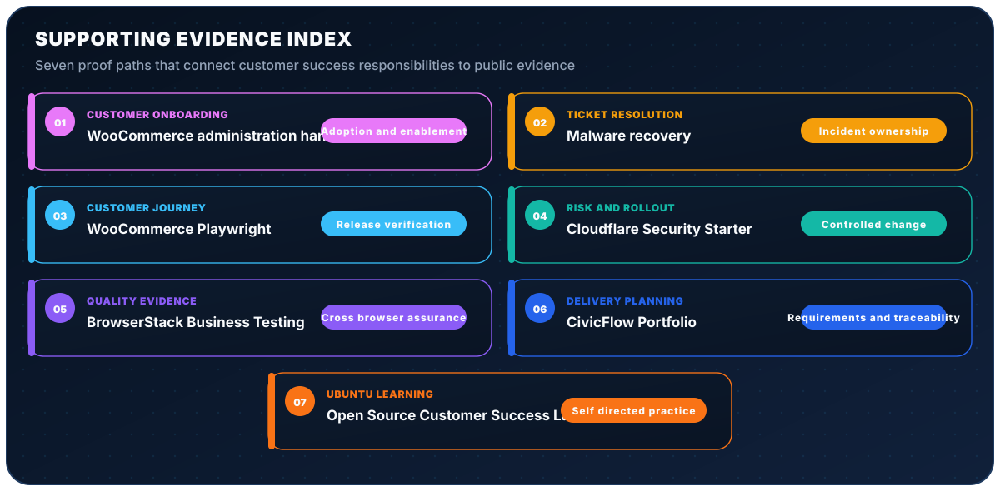
</picture>

  
  
  
  

  
  
  

 

<picture>
  <source media="(max-width: 640px)" srcset="./assets/background-panel-mobile-v2.svg" />
  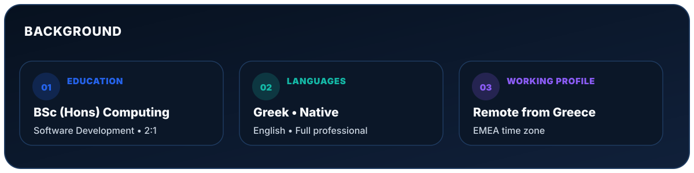
</picture>

 

<a href="mailto:a.zaprios@gmail.com">
  <picture>
    <source media="(max-width: 640px)" srcset="./assets/contact-panel-mobile-final-v3.svg" />
    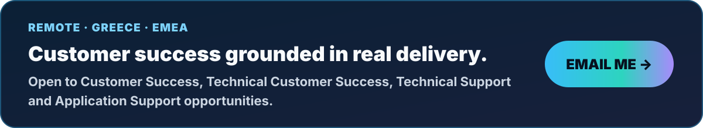
  </picture>
</a>

  

  
  

