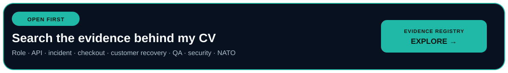
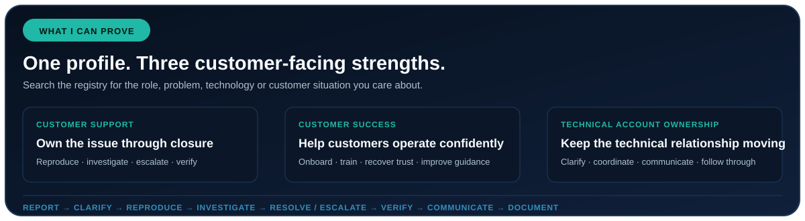
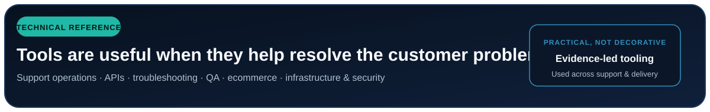
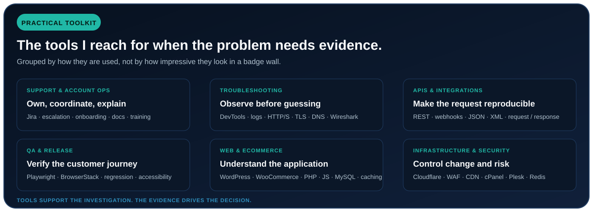

  <picture>
    <source media="(max-width: 640px)" srcset="./assets/customer-success-hero-mobile-v4.svg" />
    
  </picture>

  <strong>Client Relationship &amp; Technical Delivery Portfolio</strong> 
  This GitHub is primarily about how I support client relationships across B2B delivery. The technical work is supporting evidence: the main story is how I clarify needs, set expectations, coordinate specialists, resolve escalations and carry work through to a verified outcome.

  <strong>Customer Success · Technical Support · Client Delivery · Web Operations</strong> 
  ~30 B2B accounts · 60 production sites · 30 e-commerce sites · EU-remote

  <a href="https://zpthanos.github.io/zpthanos/"><strong>Client Evidence Registry</strong></a>
  &nbsp;·&nbsp;
  <a href="https://github.com/zpthanos/production-stories"><strong>21 Client &amp; Production Cases</strong></a>
  &nbsp;·&nbsp;
  <a href="mailto:a.zaprios@gmail.com"><strong>Contact</strong></a>

<a href="https://zpthanos.github.io/zpthanos/">
  <picture>
    <source media="(max-width: 640px)" srcset="./assets/evidence-registry-cta-mobile.svg" />
    
  </picture>
</a>

## How I support client relationships

- **Relationship ownership:** maintain ongoing engagement, understand the client behind the ticket, communicate progress and follow through until the outcome is confirmed.
- **Discovery and expectation setting:** turn incomplete or ambiguous requests into clear requirements, practical options, priorities and reviewable deliverables.
- **Cross-functional coordination:** connect clients with developers, QA, hosting providers, external services and other specialists without losing context between handoffs.
- **Escalation and trust recovery:** handle payment, access, content, performance and integration problems—including dissatisfied-client situations where clarity and credibility matter.
- **Onboarding and adoption:** provide practical training, handover, post-launch support and reusable guidance that helps non-technical clients operate independently.
- **Account development:** identify useful opportunities beyond the first request, including pricing, booking, partner discovery, digital menus and QR-based hospitality journeys.
- **Reliable client operations:** keep Jira case notes, evidence, priorities, decisions, handoffs, functional QA and documentation clear enough for both clients and technical teams.

| Relationship evidence at a glance | Scope |
| --- | --- |
| B2B client accounts | ~30 |
| Production sites supported | 60 |
| E-commerce sites (within the production portfolio) | 30 |
| Early-stage HORECA SaaS exposure | 500+ businesses |
| First-hand client and production cases | 21 |

<a href="https://zpthanos.github.io/zpthanos/">
  <picture>
    <source media="(max-width: 640px)" srcset="./assets/registry-snapshot-mobile.svg" />
    
  </picture>
</a>

## Client relationship evidence

- **[Recovering an unhappy client relationship](https://github.com/zpthanos/production-stories/blob/main/stories/17-client-relationship-recovery.md)** — reopened requirements, listened to dissatisfaction, reset expectations, coordinated revised delivery and restored confidence through validation and approval.
- **[End-to-end client engagements](https://github.com/zpthanos/production-stories/blob/main/stories/07-end-to-end-client-engagements.md)** — discovery, requirements, delivery decisions, expectation setting, incident communication and post-launch support.
- **[Creating structure from an ambiguous request](https://github.com/zpthanos/production-stories/blob/main/stories/14-ambiguous-requirements.md)** — turned an unclear business need into concrete requirements, recommendations and reviewable outcomes.
- **[WooCommerce operations and customer handover](https://github.com/zpthanos/production-stories/blob/main/stories/05-woocommerce-administration-handover.md)** — established workflows for a 2,000+ product store, configured the first 200 products and trained a non-technical owner.
- **[Prioritization under competing demands](https://github.com/zpthanos/production-stories/blob/main/stories/15-competing-priorities.md)** — prioritized concurrent client requests by urgency, business impact, dependencies and capacity while keeping stakeholders informed.
- **[Proactive business-value recommendation](https://github.com/zpthanos/production-stories/blob/main/stories/18-business-value-recommendation.md)** — proposed digital menus and QR access that extended a hospitality website into a practical guest-service channel.
- **[Delivering beyond the original request](https://github.com/zpthanos/production-stories/blob/main/stories/16-beyond-original-request.md)** — expanded a presentation brief into pricing, booking and partner-discovery functionality based on the customer journey.

## Technical proof behind client outcomes

These repositories are included to show that my client communication is backed by practical troubleshooting, QA, delivery and web-operations capability.

- **[Production Engineering Stories](https://github.com/zpthanos/production-stories)** — 21 first-hand, sanitized cases across client delivery, incidents, integrations, QA, relationship recovery and support improvement.
- **[WooCommerce Playwright](https://github.com/zpthanos/WooCommerce-Playwright)** — executable checkout verification with accessibility checks, CI, traces and reports.
- **[BrowserStack Business Testing](https://github.com/zpthanos/Browserstack-Business-Testing)** — cross-browser automation, release evidence and testing operations.
- **[Cloudflare Security Starter](https://github.com/zpthanos/Cloudflare-Security-Starter)** — request controls, WAF, rate limiting, monitoring and safe rollout thinking.

---

<picture>
  <source media="(max-width: 640px)" srcset="./assets/technical-reference-mobile.svg" />
  
</picture>

<strong>Browse the supporting technical toolkit</strong>

 

<picture>
  <source media="(max-width: 640px)" srcset="./assets/technical-toolkit-mobile.svg" />
  
</picture>

---

  <strong>Athanasios Zaprios</strong> 
  Client Relationships · Technical Support · B2B Delivery · Web Operations 
  Serres, Greece · EU work authorization · EMEA-aligned remote work 
  BSc (Hons) Computing — Software Development, 2:1 · Graduated October 2025  
  <a href="mailto:a.zaprios@gmail.com">a.zaprios@gmail.com</a>

