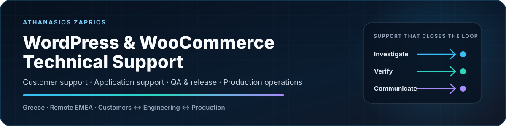

  <picture>
    <source media="(max-width: 640px)" srcset="./assets/profile-hero-mobile-2026-v3.svg" />
    
  </picture>

  <strong>Customer-facing technical support for WordPress and WooCommerce, grounded in production operations, QA and clear communication.</strong> 
  Based in Greece · Open to fully remote EMEA roles

  
  
  

I specialise in customer-facing support for WordPress and WooCommerce products, stores and websites. I investigate incidents, reproduce defects, coordinate with engineering and hosting teams, verify releases and document outcomes customers can use.

**Primary role fit:** WordPress & WooCommerce Technical Support · Application Support · Customer Success Engineering  
**Additional delivery fit:** Technical Accounts · QA & Release · Solutions & Implementation

## Featured work

| Project | What it proves | Fast review |
| --- | --- | --- |
| **[WooCommerce Playwright →](https://github.com/zpthanos/WooCommerce-Playwright)** | A safe guest-checkout regression journey with accessibility checks, CI, reports and failure evidence; deliberately stops before order submission | [README](https://github.com/zpthanos/WooCommerce-Playwright#readme) · [Architecture](https://github.com/zpthanos/WooCommerce-Playwright/blob/main/ARCHITECTURE.md) |
| **[Production Stories →](https://github.com/zpthanos/production-stories)** | 21 sanitized, first-hand cases covering incidents, customer communication, QA, delivery decisions and operational outcomes | [Featured stories](https://github.com/zpthanos/production-stories#featured-stories) · [Start by role](https://github.com/zpthanos/production-stories#start-here-by-role) |
| **[Cloudflare Security Starter →](https://github.com/zpthanos/Cloudflare-Security-Starter)** | A tested security starter with rate limits, headers, WAF templates and staged rollout guidance with explicit scope boundaries | [README](https://github.com/zpthanos/Cloudflare-Security-Starter#readme) · [Architecture](https://github.com/zpthanos/Cloudflare-Security-Starter/blob/main/ARCHITECTURE.md) |
| **[BrowserStack Business Testing →](https://github.com/zpthanos/Browserstack-Business-Testing)** | Cross-browser automation with secure configuration, reporting, CI, operational runbooks and practical go-live guidance | [README](https://github.com/zpthanos/Browserstack-Business-Testing#readme) · [Architecture](https://github.com/zpthanos/Browserstack-Business-Testing/blob/main/ARCHITECTURE.md) |

## Production evidence

<table>
  <tr>
    <td width="25%" align="center" valign="top"><strong>60+</strong> live sites and applications</td>
    <td width="25%" align="center" valign="top"><strong>30</strong> client engagements</td>
    <td width="25%" align="center" valign="top"><strong>2,000+</strong> WooCommerce products supported</td>
    <td width="25%" align="center" valign="top"><strong>3+ years</strong> client-facing technical delivery</td>
  </tr>
</table>

### Selected outcomes

- Recovered and safely relaunched a malware-affected WordPress ecommerce site after restoring verified off-server backups, rotating credentials and validating critical journeys.
- Improved product-page PageSpeed performance from below 20 to above 75 while preserving catalogue, cart and checkout functionality.
- Supported a 2,000+ product WooCommerce operation and enabled a previously non-technical owner to manage routine catalogue work independently.

## Core capabilities

| Area | Practical focus |
| --- | --- |
| **WordPress & WooCommerce support** | Customer guidance, configuration, plugin and theme conflicts, form workflows, catalogue operations, checkout and handover |
| **Application and incident support** | Reproduction, isolation, logs, browser and network evidence, PHP errors, SQL checks, recovery and closure |
| **Quality and release assurance** | Functional, regression, accessibility and cross-browser testing with visible evidence and release verification |
| **Technical account delivery** | Discovery, requirements, prioritization, stakeholder updates, integrations, training and post-launch ownership |

  
  
  
  
  
  
  
  

<strong>How I handle customer and production work</strong>

 

| Phase | What I do |
| --- | --- |
| **Understand** | Clarify the goal, affected users, urgency, environment and expected behaviour |
| **Investigate** | Reproduce the issue, isolate variables and collect useful technical evidence |
| **Coordinate** | Align customers, developers, hosting providers and third-party services around a safe path |
| **Verify** | Test the requested outcome and critical regressions, then record evidence and limitations |
| **Enable** | Document the result, train users and continue support after release |

<strong>Additional portfolio work and current development</strong>

 

- **[CivicFlow](https://github.com/zpthanos/civicflow-portfolio):** requirements, business rules, traceability, delivery controls and a bounded implementation direction. [10-minute recruiter review →](https://github.com/zpthanos/civicflow-portfolio/blob/main/RECRUITER_REVIEW.md)
- Expanding the WooCommerce Playwright suite with stronger release evidence and store-specific journey patterns.
- Strengthening architecture, CI and reviewer guidance across the featured portfolio.
- Adding production stories that show investigation, trade-offs, verification and operational lessons.
- **[View the public portfolio roadmap →](ROADMAP.md)**

## Education and working profile

**BSc (Hons) Computing — Software Development, 2:1**  
University of Essex degree delivered through Aegean College · Graduated 2026

Greek: Native · English: Full professional working proficiency  
Remote from Greece · EMEA time zone

## Contact

**Email:** [a.zaprios@gmail.com](mailto:a.zaprios@gmail.com)  
**GitHub:** [github.com/zpthanos](https://github.com/zpthanos)  
**Production stories:** [github.com/zpthanos/production-stories](https://github.com/zpthanos/production-stories)
