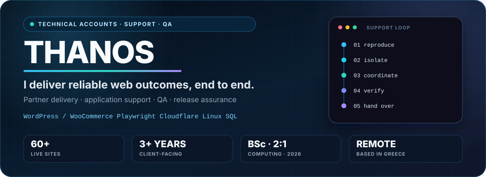

  <picture>
    <source media="(max-width: 640px)" srcset="./assets/profile-hero-mobile.svg" />
    
  </picture>

 

  
  
  
  
  
  

<h1 align="center">Technical Account Management · Web Application Support &amp; QA</h1>

  <strong>WordPress / WooCommerce · Partner Delivery · Production Operations · Release Assurance</strong> 
  Greece · Open to fully remote roles

> I own the partner journey from an unclear request to a safe, verified production outcome. My work combines WordPress/WooCommerce administration, requirements discovery, delivery coordination, incident response, regression testing, documentation, training, and long-term support.

## Recruiter snapshot

| Signal | Evidence |
| --- | --- |
| **Immediate fit** | Technical Account Management · WordPress/WooCommerce Partner Support · Web Application Support · QA & Release |
| **Production scale** | Support, maintenance, troubleshooting, QA, migrations, and launch work across **60+ live websites and applications** |
| **Partner scope** | Approximately **30 client website engagements** with growing ownership across requirements, delivery, QA, launch, training, and support |
| **Ownership model** | Understand → define → prioritize → coordinate → verify → enable → support |
| **Education** | BSc (Hons) Computing — Software Development, **2:1**, graduated 2026 |
| **Working profile** | Based in Greece · fully remote · Greek native · English at full professional working proficiency |

## Featured work

  
  
  
  

 

| Repository | Recruiter signal | Honest scope |
| --- | --- | --- |
| **[WooCommerce Playwright →](https://github.com/zpthanos/WooCommerce-Playwright)** | Playwright, TypeScript, axe accessibility checks, reports, and GitHub Actions | Chromium guest journey from product to checkout; deliberately stops before order submission |
| **[Cloudflare Security Starter →](https://github.com/zpthanos/Cloudflare-Security-Starter)** | TypeScript Worker, request validation, rate limits, security headers, WAF templates, and safe rollout guidance | Tested starter and deployment templates; not represented as a live production deployment |
| **[BrowserStack Business Testing →](https://github.com/zpthanos/Browserstack-Business-Testing)** | Cross-browser matrix, test operations, secure configuration, reporting, CI, and adoption runbooks | Working starter with generic demo checks; real business-journey coverage is the next extension |
| **[CivicFlow →](https://github.com/zpthanos/civicflow-portfolio)** | Requirements engineering, business rules, traceability, delivery controls, and verification strategy | Requirements baseline plus a bounded applicant login/draft slice; not represented as production-ready |

**[Browse every public repository →](https://github.com/zpthanos?tab=repositories)**

## Partner delivery and support lifecycle

| 01 / Understand | 02 / Define | 03 / Prioritize | 04 / Coordinate | 05 / Verify | 06 / Enable |
| --- | --- | --- | --- | --- | --- |
| Learn the business goal, user impact, and technical context | Turn ambiguous input into concrete, testable requirements | Balance urgency, dependencies, capacity, timeline, and risk | Align partners, developers, providers, and the safest delivery path | Test the outcome, critical regressions, and production health | Document decisions, train users, capture feedback, and continue support |

<strong>Open the partner delivery and production support playbook</strong>

 

| Phase | Questions I answer | Typical evidence |
| --- | --- | --- |
| **Triage** | Who is affected? Is revenue, access, data, or a deadline at risk? | User report, timestamp, URL, environment, screenshots, business impact |
| **Isolation** | Is the fault in the browser, application, integration, data, hosting, DNS, or edge layer? | Reproduction steps, console/network output, PHP/server logs, SQL checks, API payloads |
| **Change control** | What is the smallest safe change? How do we reverse it? | Staging result, backup/rollback path, implementation owner, test notes |
| **Release assurance** | Did the fix work without damaging a critical journey? | Functional and regression results, browser/responsive checks, post-release monitoring |
| **Closure** | Can the customer and the next engineer understand what happened? | Resolution note, known limits, follow-up actions, user handover |

## Capability matrix

| Area | Tools and practices | Outcome I focus on |
| --- | --- | --- |
| **Partner and account delivery** | Discovery, onboarding, ambiguous requirements, prioritization, timelines, stakeholder updates, training | Build trust, drive adoption, and carry requests through to a verified outcome |
| **WordPress / WooCommerce** | Advanced administration, Site Editor, plugins/themes, catalogue, orders, payments, staging, backups | Maintainable sites and reliable customer and editor journeys |
| **Launches and integrations** | DNS, migrations, payment and email services, REST APIs, webhooks, hosting providers, rollback planning | Coordinated delivery with clear ownership, risk control, and communication |
| **Quality and incident response** | Urgent triage, root-cause investigation, functional/regression testing, accessibility, browser/responsive coverage | Restore critical journeys and verify solutions before closure |
| **Technical analysis** | SQL/MySQL, JSON, HTML/CSS, JavaScript/TypeScript, PHP errors, logs, performance, technical SEO | Move from an unclear symptom or goal to concrete next steps |
| **Documentation and responsible AI** | Sanitized evidence, ChatGPT/Claude drafting, partner updates, technical tasks, QA plans, training, source verification | Reuse verified understanding safely while retaining confidentiality, human approval, and final accountability |

<strong>Application and integration toolkit</strong> — inspect the layers behind the interface

 

| Layer | Practical focus |
| --- | --- |
| Browser | DevTools, console/network evidence, responsive behavior, accessibility, cache/session state |
| Application | WordPress/WooCommerce configuration, plugins/themes, PHP errors, roles, checkout/account flows |
| Integration | REST APIs, webhooks, JSON payloads, authentication, status codes, retries, data mapping |
| Data | SQL/MySQL checks, state validation, safe updates, backups, reconciliation |
| Platform | Linux, web servers, hosting panels, DNS, SSL, Cloudflare, Redis, caching, recovery |

<strong>Quality and release toolkit</strong> — turn requirements into reviewable evidence

 

| Practice | What good looks like |
| --- | --- |
| Functional testing | Assertions cover the business outcome, not only the clicks |
| Regression testing | Critical paths stay protected when the fix lands |
| Browser & responsive testing | Real target combinations are chosen from user and risk data |
| Accessibility | Automated checks support — but do not replace — meaningful manual review |
| Release verification | Evidence, scope, environment, result, limitation, and follow-up are recorded |

<strong>Evidence-led documentation workflow</strong> — responsible AI assistance with human approval

 

| Stage | Working control |
| --- | --- |
| **Prepare** | Capture the confirmed behaviour, environment, reproduction steps, relevant documentation, logs, and business impact |
| **Protect** | Remove client identities, credentials, tokens, personal information, and unnecessary production data before using AI |
| **Transform** | Use ChatGPT and Claude to draft partner updates, technical tasks, QA plans, training material, and reusable guidance |
| **Verify** | Compare every technical claim with its source, label assumptions and missing information, and correct the output manually |
| **Approve** | Keep AI outside production access and deployment; retain human approval and escalation for every consequential action |

The purpose is simple: investigate carefully once, then safely reuse the verified understanding across delivery and communication.

## Selected production impact

| Situation | Result |
| --- | --- |
| **[Critical malware recovery →](https://github.com/zpthanos/production-stories/blob/main/stories/06-malware-recovery.md)** | Safely relaunched a compromised WordPress ecommerce site after clean recovery, credential rotation, and end-to-end validation |
| **[WooCommerce customer handover →](https://github.com/zpthanos/production-stories/blob/main/stories/05-woocommerce-administration-handover.md)** | Configured the first 200 products and core workflows for a 2,000+ product store, then trained a previously non-technical owner |
| **[PageSpeed improvement →](https://github.com/zpthanos/production-stories/blob/main/stories/11-pagespeed-improvement.md)** | Increased a production store’s PageSpeed score from below 20 to above 75 while preserving critical ecommerce journeys |

  

<strong>View selected live production examples</strong>

 

| Website | Contribution |
| --- | --- |
| **[Stamatopoulos Bikes →](https://www.stamatopoulosbikes.gr/)** | WooCommerce production support |
| **[ORA by Mavrommatis →](https://www.orabymavrommatis.com/)** | Ecommerce production support |
| **[FM Live →](https://www.fmlive.gr/)** | Media-platform production support |

I have supported more than 60 production websites and web applications. Responsibilities vary by engagement and include support, maintenance, configuration, integrations, QA, troubleshooting, performance work, migrations, launch support, and user training. I do not claim sole delivery of every site in that portfolio.

## Contact

<table>
  <tr>
    <td><strong>Target roles</strong></td>
    <td>Technical Account Management · WordPress/WooCommerce Partner Support · Web Application Support · QA &amp; Release</td>
  </tr>
  <tr>
    <td><strong>Location</strong></td>
    <td>Greece · available for fully remote work</td>
  </tr>
  <tr>
    <td><strong>Start here</strong></td>
    <td><a href="mailto:a.zaprios@gmail.com">a.zaprios@gmail.com</a> · <a href="https://github.com/zpthanos?tab=repositories">All repositories</a> · <a href="https://github.com/zpthanos/production-stories">Production stories</a></td>
  </tr>
</table>

   
  <strong>Reliable systems. Clear evidence. Calm delivery.</strong>
    
  

