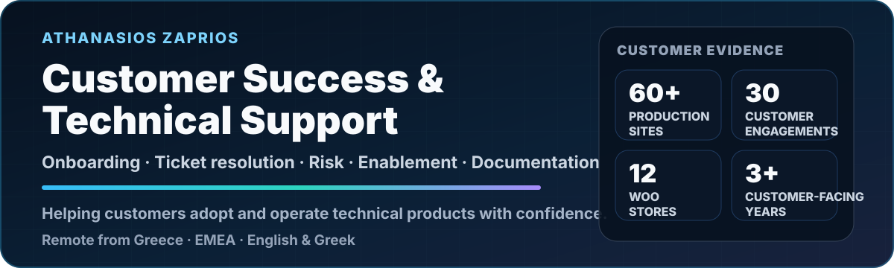
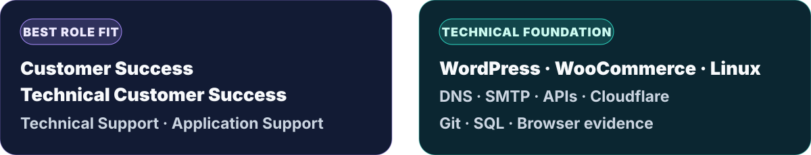
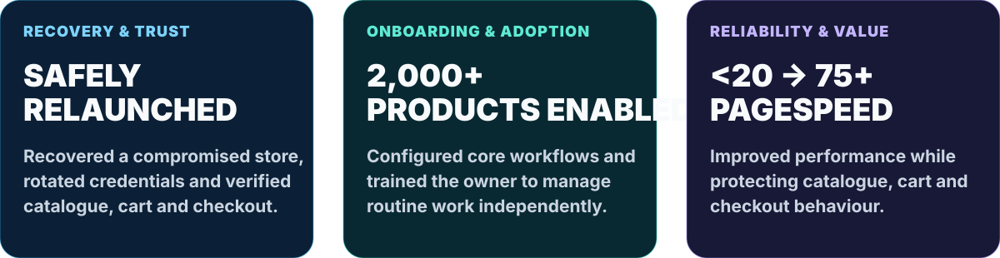

  <picture>
    <source media="(max-width: 640px)" srcset="./assets/customer-success-hero-mobile-final-v3.svg" />
    
  </picture>

  

<a href="https://github.com/zpthanos/production-stories">
  <picture>
    <source media="(max-width: 640px)" srcset="./assets/production-stories-cta-mobile-final-v2.svg" />
    
  </picture>
</a>

 

  
  
  

I help customers **adopt, operate and gain value from technical products**. My work combines onboarding, ticket resolution, documentation, risk identification and cross-functional coordination with hands-on production support.

<picture>
  <source media="(max-width: 640px)" srcset="./assets/positioning-panel-mobile-final-v2.svg" />
  
</picture>

 

<picture>
  <source media="(max-width: 640px)" srcset="./assets/customer-success-loop-mobile-v1.svg" />
  
</picture>

## Why I fit customer success

> Clear evidence for the responsibilities recruiters usually need to verify first.

<table>
  <tr>
    <td width="50%" valign="top">
      🚀&nbsp;&nbsp;  
      Configure the foundations, explain workflows clearly and train users until routine work can be completed independently.  
      <strong>Evidence:</strong> enabled a non-technical owner to manage catalogue, order and refund work across a <strong>2,000+ product</strong> operation.
    </td>
    <td width="50%" valign="top">
      🎫&nbsp;&nbsp;  
      Reproduce the issue, gather useful evidence, troubleshoot, escalate clearly and verify the customer outcome before closure.  
      <strong>Evidence:</strong> support across access, payments, email, updates, backups, configuration and performance.
    </td>
  </tr>
  <tr>
    <td width="50%" valign="top">
      🧭&nbsp;&nbsp;  
      Clarify customer objectives, turn unclear requests into practical plans and keep owners aligned on progress and next actions.  
      <strong>Evidence:</strong> approximately <strong>30 customer engagements</strong> across customers, developers, hosts and third parties.
    </td>
    <td width="50%" valign="top">
      🛡️&nbsp;&nbsp;  
      Identify recurring friction, security concerns, release risk and adoption blockers before they become larger customer problems.  
      <strong>Evidence:</strong> incident recovery, recurring-issue analysis, controlled changes and critical-journey verification.
    </td>
  </tr>
  <tr>
    <td width="50%" valign="top">
      📝&nbsp;&nbsp;  
      Create customer guidance, Q&amp;A, troubleshooting notes, onboarding material, QA checklists and handover documentation.  
      <strong>Evidence:</strong> repeatable support knowledge that reduces ambiguity and customer dependence.
    </td>
    <td width="50%" valign="top">
      💬&nbsp;&nbsp;  
      Convert recurring questions, defects and customer observations into structured findings that technical teams can review.  
      <strong>Evidence:</strong> issue reports with reproduction steps, limitations, operational context and follow-up actions.
    </td>
  </tr>
</table>

  <a href="./CUSTOMER_SUCCESS_REVIEW.md"><strong>Review the complete evidence map →</strong></a>

## Three outcomes worth remembering

<picture>
  <source media="(max-width: 640px)" srcset="./assets/customer-success-outcomes-mobile-final-v2.svg" />
  
</picture>

  <a href="https://github.com/zpthanos/production-stories/blob/main/stories/06-malware-recovery.md"><strong>Recovery &amp; trust →</strong></a>
  &nbsp;&nbsp;·&nbsp;&nbsp;
  <a href="https://github.com/zpthanos/production-stories/blob/main/stories/05-woocommerce-administration-handover.md"><strong>Onboarding &amp; adoption →</strong></a>
  &nbsp;&nbsp;·&nbsp;&nbsp;
  <a href="https://github.com/zpthanos/production-stories/blob/main/stories/11-pagespeed-improvement.md"><strong>Reliability &amp; value →</strong></a>

## Evidence a recruiter can verify

> Each item links to public evidence rather than another paragraph asking you to trust a stranger on the internet.

<table>
  <tr>
    <td width="50%" valign="top">
      📚&nbsp;&nbsp;  
      First-hand examples of onboarding, incidents, customer communication, risk, documentation and follow-through.  
      <a href="https://github.com/zpthanos/production-stories#featured-stories"><strong>Read featured stories →</strong></a>
    </td>
    <td width="50%" valign="top">
      🛒&nbsp;&nbsp;  
      A repeatable WooCommerce journey from product page to checkout with reports and failure evidence.  
      <a href="https://github.com/zpthanos/WooCommerce-Playwright#readme"><strong>Review WooCommerce Playwright →</strong></a>
    </td>
  </tr>
  <tr>
    <td width="50%" valign="top">
      🔐&nbsp;&nbsp;  
      A production-minded Cloudflare starter with monitor-first rollout guidance and explicit limitations.  
      <a href="https://github.com/zpthanos/Cloudflare-Security-Starter#readme"><strong>Review the security starter →</strong></a>
    </td>
    <td width="50%" valign="top">
      🌍&nbsp;&nbsp;  
      Browser testing, reporting, CI guidance and practical runbooks supporting clearer release decisions.  
      <a href="https://github.com/zpthanos/Browserstack-Business-Testing#readme"><strong>Review BrowserStack testing →</strong></a>
    </td>
  </tr>
</table>

## Open-source and infrastructure readiness

<table>
  <tr>
    <td width="50%" valign="top">
      🐧&nbsp;&nbsp;  
      Linux-based environments, access and server operations, DNS, SMTP, Cloudflare, REST APIs, webhooks, Git and SQL.  
      Comfortable moving between customer language, browser evidence, configuration, hosting and technical escalation.
    </td>
    <td width="50%" valign="top">
      🌱&nbsp;&nbsp;  
      A clearly labelled practice environment covering onboarding, support requests, customer health, adoption communication, documentation and feedback.  
      <a href="./OPEN_SOURCE_CUSTOMER_SUCCESS_LAB.md"><strong>Review the open-source customer success lab →</strong></a>
    </td>
  </tr>
  <tr>
    <td colspan="2" valign="top">
      <strong>Why this direction matters:</strong> open-source customer success combines technical problem-solving with onboarding, enablement, documentation and long-term customer value.
    </td>
  </tr>
</table>

 

<strong>🧭 Customer Request Playbook</strong> · From first report to verified closure

 

1. **Understand** — clarify the customer goal, impact, urgency, environment and expected behaviour.
2. **Reproduce** — confirm the issue and collect useful browser, system or workflow evidence.
3. **Coordinate** — align customers, developers, hosting providers or third parties around a safe plan.
4. **Verify** — test the requested outcome and the important related customer journeys.
5. **Enable** — document the result, limitations, next steps and practical customer guidance.

 

<strong>🧩 Additional Implementation &amp; Delivery Evidence</strong> · Supporting projects and practical controls

 

- **[CivicFlow Portfolio →](https://github.com/zpthanos/civicflow-portfolio)**  
  Turns complicated requests into clear rules, priorities, controls and verification plans.

- **[Cloudflare Security Starter →](https://github.com/zpthanos/Cloudflare-Security-Starter)**  
  Demonstrates monitor-first security changes, staged rollout guidance and explicit limitations.

- **[BrowserStack Business Testing →](https://github.com/zpthanos/Browserstack-Business-Testing)**  
  Demonstrates cross-browser testing, reporting, CI and operational go-live guidance.

 

<strong>🛠️ Technical Toolkit</strong> · Tools used behind the customer process

 

  
  
  
  
  
  
  
  
  
  

## Background

<table>
  <tr><td width="22%"><strong>Degree</strong></td><td>BSc (Hons) Computing — Software Development, 2:1 · University of Essex degree delivered through Aegean College · Graduated 2026</td></tr>
  <tr><td><strong>Languages</strong></td><td>Greek: Native · English: Full professional working proficiency</td></tr>
  <tr><td><strong>Working profile</strong></td><td>Remote from Greece · EMEA time zone</td></tr>
</table>

  

<a href="mailto:a.zaprios@gmail.com">
  <picture>
    <source media="(max-width: 640px)" srcset="./assets/contact-panel-mobile-final-v3.svg" />
    
  </picture>
</a>

  

  
  

