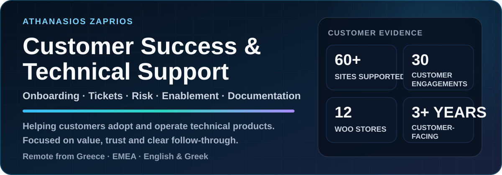
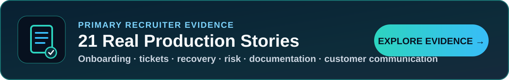
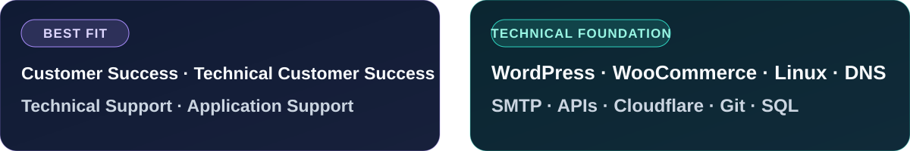
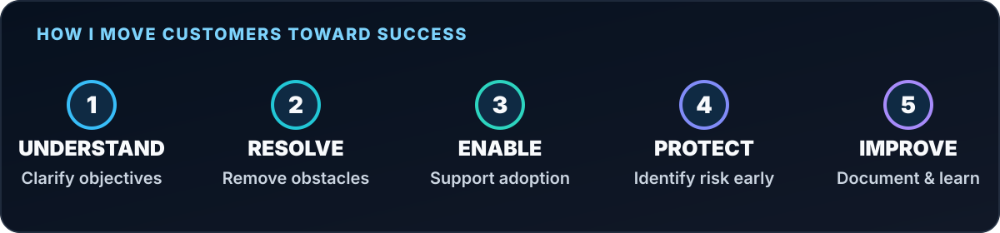
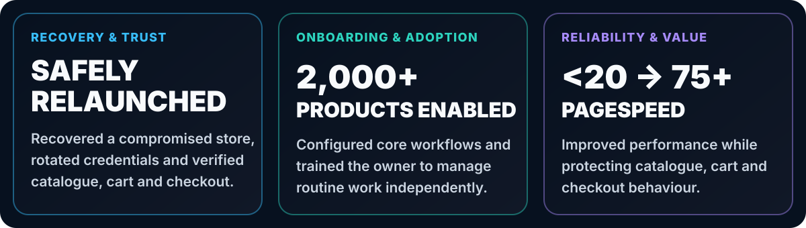
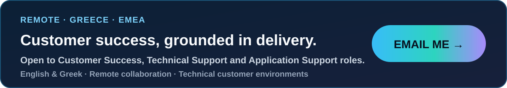

  <picture>
    <source media="(max-width: 640px)" srcset="./assets/customer-success-hero-mobile-v2.svg" />
    
  </picture>

  

<a href="https://github.com/zpthanos/production-stories">
  <picture>
    <source media="(max-width: 640px)" srcset="./assets/production-stories-cta-mobile-v1.svg" />
    
  </picture>
</a>

 

  
  

I help customers **adopt, operate and gain value from technical products**. My experience combines customer onboarding, ticket resolution, documentation, risk identification and cross-functional coordination with hands-on production support.

<picture>
  <source media="(max-width: 640px)" srcset="./assets/positioning-panel-mobile-v1.svg" />
  
</picture>

 

<picture>
  <source media="(max-width: 640px)" srcset="./assets/customer-success-loop-mobile-v1.svg" />
  
</picture>

## Why I fit customer success

<table>
  <tr>
    <td width="50%" valign="top">
      🚀&nbsp;&nbsp;  
      Introduce workflows in practical language, configure the foundations and train users until they can complete routine work independently.  
      <strong>Proof:</strong> enabled a non-technical owner to manage catalogue, order and refund work across a <strong>2,000+ product</strong> operation.
    </td>
    <td width="50%" valign="top">
      🎫&nbsp;&nbsp;  
      Reproduce the issue, gather useful evidence, troubleshoot, escalate clearly and verify the complete customer journey before closure.  
      <strong>Proof:</strong> support requests across access, payments, email, updates, backups, performance, configuration and day-to-day operations.
    </td>
  </tr>
  <tr>
    <td width="50%" valign="top">
      🧭&nbsp;&nbsp;  
      Clarify customer objectives, turn vague requests into practical plans, communicate progress and coordinate the right people.  
      <strong>Proof:</strong> approximately <strong>30 customer engagements</strong> across customers, developers, hosting providers and third-party services.
    </td>
    <td width="50%" valign="top">
      🛡️&nbsp;&nbsp;  
      Recognise recurring friction, security concerns, release risk and adoption blockers before they become larger customer problems.  
      <strong>Proof:</strong> incident recovery, recurring-issue analysis, controlled changes and verification of critical journeys.
    </td>
  </tr>
  <tr>
    <td width="50%" valign="top">
      📝&nbsp;&nbsp;  
      Create customer guidance, Q&amp;A, troubleshooting notes, onboarding material, QA checklists and handover documentation.  
      <strong>Proof:</strong> repeatable support knowledge that reduces ambiguity and helps customers operate with less dependence.
    </td>
    <td width="50%" valign="top">
      💬&nbsp;&nbsp;  
      Turn recurring questions, defects and customer observations into structured findings that technical teams can review and act on.  
      <strong>Proof:</strong> evidence-based issue reports, documented limitations, operational lessons and clear follow-up actions.
    </td>
  </tr>
</table>

  <a href="./CUSTOMER_SUCCESS_REVIEW.md"><strong>Review the complete customer-success evidence map →</strong></a>

## Three outcomes worth remembering

<picture>
  <source media="(max-width: 640px)" srcset="./assets/customer-success-outcomes-mobile-v1.svg" />
  
</picture>

  <a href="https://github.com/zpthanos/production-stories/blob/main/stories/06-malware-recovery.md"><strong>Recovery &amp; trust →</strong></a>
  &nbsp;·&nbsp;
  <a href="https://github.com/zpthanos/production-stories/blob/main/stories/05-woocommerce-administration-handover.md"><strong>Onboarding &amp; adoption →</strong></a>
  &nbsp;·&nbsp;
  <a href="https://github.com/zpthanos/production-stories/blob/main/stories/11-pagespeed-improvement.md"><strong>Reliability &amp; value →</strong></a>

## Evidence a recruiter can verify

<table>
  <tr>
    <td valign="top">
      📚&nbsp;&nbsp;  
      Sanitized, first-hand examples of customer communication, incident handling, onboarding, risk, documentation, delivery decisions and follow-through.  
      <a href="https://github.com/zpthanos/production-stories#featured-stories"><strong>Read featured stories →</strong></a>
    </td>
  </tr>
  <tr>
    <td valign="top">
      🛒&nbsp;&nbsp;  
      A repeatable WooCommerce journey from product page to checkout with accessibility checks, reports and failure evidence for safer release decisions.  
      <a href="https://github.com/zpthanos/WooCommerce-Playwright#readme"><strong>Review WooCommerce Playwright →</strong></a>
    </td>
  </tr>
  <tr>
    <td valign="top">
      🔐&nbsp;&nbsp;  
      A production-minded Cloudflare starter using request validation, rate limits, security headers and monitor-first rollout guidance.  
      <a href="https://github.com/zpthanos/Cloudflare-Security-Starter#readme"><strong>Review the security starter →</strong></a>
    </td>
  </tr>
  <tr>
    <td valign="top">
      🌍&nbsp;&nbsp;  
      Browser testing, secure configuration, reporting, CI guidance and practical runbooks designed to support clear go-live decisions.  
      <a href="https://github.com/zpthanos/Browserstack-Business-Testing#readme"><strong>Review BrowserStack testing →</strong></a>
    </td>
  </tr>
</table>

## Open-source and infrastructure readiness

<table>
  <tr>
    <td valign="top">
      🐧&nbsp;&nbsp;  
      Linux-based environments, access and server operations, DNS, SMTP, Cloudflare, REST APIs, webhooks, Git and SQL.  
      I am comfortable moving between customer language, browser evidence, configuration, hosting and technical escalation.
    </td>
  </tr>
  <tr>
    <td valign="top">
      🌱&nbsp;&nbsp;  
      I am actively deepening my understanding of Ubuntu, open-source infrastructure and the customer journeys around security, fleet management, cloud and platform adoption.  
      I label self-directed learning honestly and do not present it as production customer experience.
    </td>
  </tr>
  <tr>
    <td valign="top">
      <strong>Why this direction matters:</strong> open-source customer success combines technical problem-solving with onboarding, enablement, documentation and long-term customer value.
    </td>
  </tr>
</table>

  

 

| Stage | Customer question | What I do |
| --- | --- | --- |
| **1. Understand** | What is the customer trying to achieve? | Clarify the goal, impact, urgency, environment and expected behaviour. |
| **2. Reproduce** | Can I see the same problem? | Repeat the issue and collect useful browser, system or workflow evidence instead of guessing. |
| **3. Coordinate** | Who needs to act? | Align customers, developers, hosting providers or third parties around a safe action plan. |
| **4. Verify** | Did the solution work? | Test the requested outcome and important related customer journeys before closure. |
| **5. Enable** | Can the customer use the result? | Document the outcome, limitations, next steps and practical customer guidance. |

 

 

 

<table>
  <tr><td valign="top"><strong><a href="https://github.com/zpthanos/civicflow-portfolio">CivicFlow Portfolio →</a></strong>  Shows how complicated requests become clear rules, priorities, controls and verification plans.</td></tr>
  <tr><td valign="top"><strong><a href="https://github.com/zpthanos/Cloudflare-Security-Starter">Cloudflare Security Starter →</a></strong>  Shows monitor-first security changes, staged rollout guidance and explicit limitations.</td></tr>
  <tr><td valign="top"><strong><a href="https://github.com/zpthanos/Browserstack-Business-Testing">BrowserStack Business Testing →</a></strong>  Shows cross-browser testing, reporting, CI and operational go-live guidance.</td></tr>
</table>

 

 

 

These tools support investigation, delivery, verification and clear customer communication across technical environments.

  
  
  
  
  
  
  
  
  
  

 

## Background

- **BSc (Hons) Computing — Software Development, 2:1**
- University of Essex degree delivered through Aegean College · Graduated 2026
- Greek: Native · English: Full professional working proficiency
- Remote from Greece · EMEA time zone

 

   

  
  

