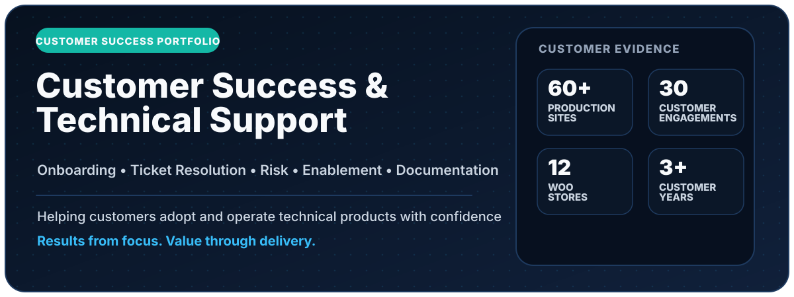

  <picture>
    <source media="(max-width: 640px)" srcset="./assets/customer-success-hero-mobile-v4.svg" />
    
  </picture>

  

    <strong>Technical Support &amp; Customer Engineering Specialist</strong> 
    Production operations · APIs &amp; integrations · issue reproduction · QA · incident response
  

  

    <strong>60</strong> production sites &nbsp;·&nbsp;
    <strong>~30</strong> client accounts &nbsp;·&nbsp;
    <strong>12</strong> WooCommerce stores &nbsp;·&nbsp;
    <strong>21</strong> documented production cases
  

  

    <a href="https://zpthanos.github.io/zpthanos/"><strong>Explore the evidence registry →</strong></a>
    &nbsp;·&nbsp;
    <a href="https://github.com/zpthanos/production-stories"><strong>Production casebook</strong></a>
    &nbsp;·&nbsp;
    <a href="mailto:a.zaprios@gmail.com"><strong>Contact</strong></a>
  

---

## Evidence, not a second CV

My CV explains the experience. This GitHub keeps the proof behind it: first-hand production cases, executable technical work, troubleshooting evidence, QA, incident handling, integrations, customer communication and reusable documentation.

The interactive registry lets you search by **role, technology, symptom or situation**. Try things like `API`, `checkout`, `incident`, `unhappy customer`, `QA`, `security`, `requirements`, `onboarding` or `NATO`.

## How I work a problem

**Customer report → clarify → reproduce → investigate → resolve or escalate → verify → communicate → document**

The useful part is not knowing every answer immediately. It is reducing uncertainty quickly, collecting the right evidence, keeping the customer informed and leaving the next person with a better path.

## Start with proof

| Evidence | What you can inspect |
|---|---|
| [Production Engineering Stories](https://github.com/zpthanos/production-stories) | 21 first-hand production cases covering incidents, integrations, customer recovery, QA, documentation and delivery decisions |
| [WooCommerce Playwright](https://github.com/zpthanos/WooCommerce-Playwright) | End-to-end checkout testing, axe accessibility checks, CI, traces, screenshots and reports |
| [BrowserStack Business Testing](https://github.com/zpthanos/Browserstack-Business-Testing) | Cross-browser automation, Playwright/TypeScript, GitHub Actions, test operations and release guidance |
| [Cloudflare Security Starter](https://github.com/zpthanos/Cloudflare-Security-Starter) | Worker request controls, WAF templates, rate limiting, monitoring and safe rollout guidance |
| [The Washland Portal](https://github.com/zpthanos/The-Washland-Portal) | PHP 8.2, MySQL, PDO, validation, CRUD, JSON endpoints and explicit HTTP behaviour |
| [CivicFlow](https://github.com/zpthanos/civicflow-portfolio) | Requirements engineering, business rules, acceptance criteria, traceability, test strategy and delivery planning |

A few useful production cases:

- [Critical malware recovery](https://github.com/zpthanos/production-stories/blob/main/stories/06-malware-recovery.md) — incident ownership, safe recovery and full customer-journey validation.
- [Payment / checkout troubleshooting](https://github.com/zpthanos/production-stories/blob/main/stories/03-payoneer-funnelkit-conflict.md) — reproduction, integration troubleshooting and regression verification.
- [Recovering an unhappy client relationship](https://github.com/zpthanos/production-stories/blob/main/stories/17-client-relationship-recovery.md) — requirements reset, communication, ownership and trust recovery.
- [Reducing recurring cache complaints](https://github.com/zpthanos/production-stories/blob/main/stories/19-recurring-cache-complaints.md) — turning repeated support friction into a clearer reusable process.
- [WooCommerce operations and customer handover](https://github.com/zpthanos/production-stories/blob/main/stories/05-woocommerce-administration-handover.md) — operational setup, customer enablement and ongoing support.

Production stories are first-hand and sanitized where necessary. Public technical exercises and personal projects are kept distinct from commercial production experience.

<strong>Technical reference</strong>

 

**Support & service operations:** Jira case ownership, issue reproduction, escalation, customer updates, documentation, handover and user training.

**Troubleshooting:** browser developer tools, server/application logs, HTTP/HTTPS, TLS/SSL, DNS, SMTP, Wireshark and tcpdump.

**APIs & integrations:** REST APIs, webhooks, JSON, XML and practical integration troubleshooting.

**QA:** Playwright, BrowserStack, functional/regression testing, cross-browser validation, accessibility checks, evidence capture and release verification.

**Web & ecommerce:** WordPress, WooCommerce, PHP, JavaScript, MySQL, HTML/CSS, backups, caching, performance and content operations.

**Infrastructure & security context:** Cloudflare, WAF, CDN, cPanel, Plesk, Apache, LiteSpeed, Redis, ModSecurity, Imunify360 and Imperva.

## Contact

**Athanasios Zaprios**  
Serres, Greece · EU work authorization · EMEA-aligned remote work  
BSc (Hons) Computing — Software Development, 2:1  
[a.zaprios@gmail.com](mailto:a.zaprios@gmail.com)
