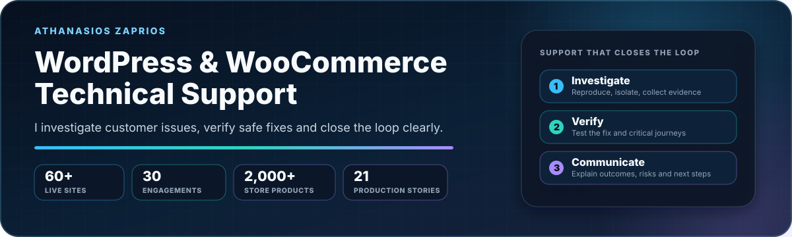
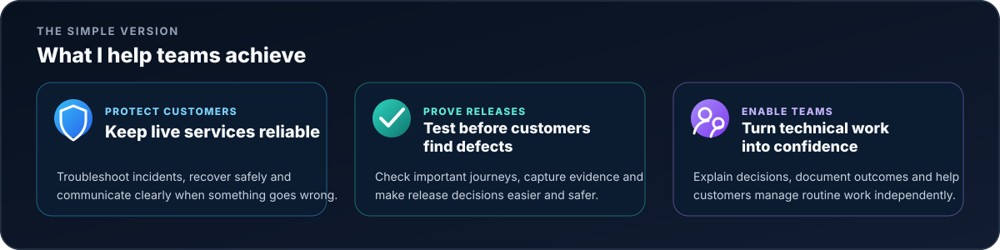
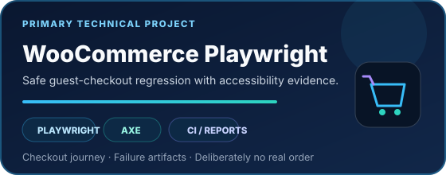
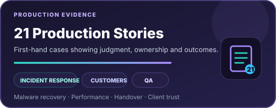
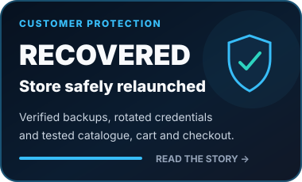
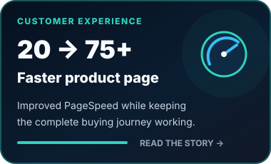
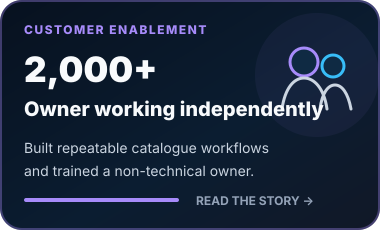
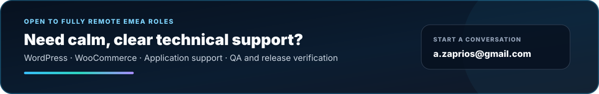

  <picture>
    <source media="(max-width: 640px)" srcset="./assets/profile-hero-mobile-2026-v4.svg" />
    
  </picture>

  <strong>Customer-facing technical support for WordPress and WooCommerce, backed by production operations, QA and clear communication.</strong> 
  Based in Greece · Open to fully remote EMEA roles

  
  
  

I specialise in customer-facing support for WordPress and WooCommerce products, stores and websites. I investigate incidents, reproduce defects, coordinate with engineering and hosting teams, verify releases and explain outcomes in language customers and colleagues can use.

**Primary role fit:** WordPress & WooCommerce Technical Support · Application Support · Customer Success Engineering  
**Additional delivery fit:** Technical Accounts · QA & Release · Solutions & Implementation

<picture>
  <source media="(max-width: 640px)" srcset="./assets/recruiter-map-mobile-v1.svg" />
  
</picture>

## Choose the proof that matches your role

<table>
  <tr>
    <td width="50%" valign="top">
      <strong>Hiring for customer or application support?</strong>  
      See real incidents, practical decisions, customer communication and safe follow-through.  
      <a href="https://github.com/zpthanos/production-stories#featured-stories"><strong>Read production stories →</strong></a>
    </td>
    <td width="50%" valign="top">
      <strong>Hiring for WordPress or WooCommerce support?</strong>  
      See a complete customer shopping journey tested before it reaches a real order.  
      <a href="https://github.com/zpthanos/WooCommerce-Playwright#readme"><strong>Review the checkout project →</strong></a>
    </td>
  </tr>
  <tr>
    <td width="50%" valign="top">
      <strong>Hiring for QA or release coordination?</strong>  
      See browser checks, accessible testing and evidence that supports release decisions.  
      <a href="https://github.com/zpthanos/Browserstack-Business-Testing#readme"><strong>Review browser testing →</strong></a>
    </td>
    <td width="50%" valign="top">
      <strong>Hiring for solutions or implementation?</strong>  
      See how unclear requirements become an understandable and testable delivery plan.  
      <a href="https://github.com/zpthanos/civicflow-portfolio/blob/main/RECRUITER_REVIEW.md"><strong>Review CivicFlow →</strong></a>
    </td>
  </tr>
</table>

 

 

<table>
  <tr>
    <td width="50%" valign="top">
      
        
      <strong>What it is</strong> 
      An automated customer shops from product page to checkout while the project checks that every important step still works.  
      <strong>Business value</strong> 
      Broken shopping journeys can be found before customers lose time, confidence or sales.  
      <a href="https://github.com/zpthanos/WooCommerce-Playwright#readme"><strong>Review the project →</strong></a>
    </td>
    <td width="50%" valign="top">
      
        
      <strong>What it is</strong> 
      Short, sanitized accounts of real support, delivery and production situations I handled.  
      <strong>Business value</strong> 
      They show judgment, communication and ownership instead of merely listing tools and responsibilities.  
      <a href="https://github.com/zpthanos/production-stories#featured-stories"><strong>Read the stories →</strong></a>
    </td>
  </tr>
</table>

<strong>Additional projects</strong>

 

<table>
  <tr>
    <td width="33%" valign="top">
      <strong><a href="https://github.com/zpthanos/Cloudflare-Security-Starter">Cloudflare Security Starter →</a></strong>  
      A reusable starting point for protecting a website from common abuse and risky traffic.  
      <strong>Why it matters:</strong> controls can be reviewed, introduced gradually and rolled back safely.
    </td>
    <td width="33%" valign="top">
      <strong><a href="https://github.com/zpthanos/Browserstack-Business-Testing">BrowserStack Business Testing →</a></strong>  
      A practical way to check that a website works across different browsers and devices.  
      <strong>Why it matters:</strong> fewer “it works on my computer” surprises reach customers.
    </td>
    <td width="33%" valign="top">
      <strong><a href="https://github.com/zpthanos/civicflow-portfolio">CivicFlow Portfolio →</a></strong>  
      A structured plan that turns a complicated request into clear rules, priorities and checks.  
      <strong>Why it matters:</strong> stakeholders understand what will be built and how success will be verified.
    </td>
  </tr>
</table>

 

 

<table>
  <tr>
    <td width="33%" valign="top">
      
    </td>
    <td width="33%" valign="top">
      
    </td>
    <td width="33%" valign="top">
      
    </td>
  </tr>
</table>

<em>Each card links to the full situation, action, result and lessons learned.</em>

 

 

<table>
  <tr>
    <td valign="top">
      <strong>🛍️ Reliable WordPress and WooCommerce support</strong>  
      I handle customer questions, configuration, forms, plugin or theme conflicts, products, cart and checkout issues. 
      <strong>You get:</strong> clear answers, verified fixes and important store journeys that continue working.
    </td>
  </tr>
  <tr>
    <td valign="top">
      <strong>🧯 Calm incident support</strong>  
      I reproduce the problem, narrow down the cause, gather useful evidence and coordinate a safe recovery path. 
      <strong>You get:</strong> a controlled resolution, practical updates and a clear explanation of what happened.
    </td>
  </tr>
  <tr>
    <td valign="top">
      <strong>✅ Confidence before a release</strong>  
      I test important customer journeys, browsers and accessibility, then capture evidence people can actually review. 
      <strong>You get:</strong> a clear view of what passed, what remains risky and whether the release is ready.
    </td>
  </tr>
  <tr>
    <td valign="top">
      <strong>🤝 Clear delivery across technical and non-technical people</strong>  
      I clarify requirements, priorities, owners, dependencies, updates, training and follow-up. 
      <strong>You get:</strong> a shared plan where everyone understands progress and the next action.
    </td>
  </tr>
</table>

<strong>My five-step support approach</strong>

 

**1. Listen — What is the customer trying to achieve?**  
Clarify the goal, impact, urgency and expected behaviour.

**2. Reproduce — Can I see the same problem?**  
Repeat the issue and collect useful evidence instead of guessing.

**3. Coordinate — Who needs to act?**  
Bring together customers, developers, hosting providers or third parties.

**4. Verify — Did the solution actually work?**  
Test the result and check that important related journeys still work.

**5. Explain — Can someone else understand and use the outcome?**  
Document the result, limitations, next steps and customer guidance.

<strong>Technical tools used behind the scenes</strong>

 

  
  
  
  
  
  
  
  

<strong>Current portfolio development</strong>

 

- Expanding the WooCommerce Playwright suite with stronger release evidence and store-specific journey patterns.
- Strengthening architecture, CI and reviewer guidance across the featured portfolio.
- Adding production stories that show investigation, trade-offs, verification and operational lessons.
- **[View the public portfolio roadmap →](ROADMAP.md)**

## Background

**BSc (Hons) Computing — Software Development, 2:1**  
University of Essex degree delivered through Aegean College · Graduated 2026

Greek: Native · English: Full professional working proficiency  
Remote from Greece · EMEA time zone

 

  
  

